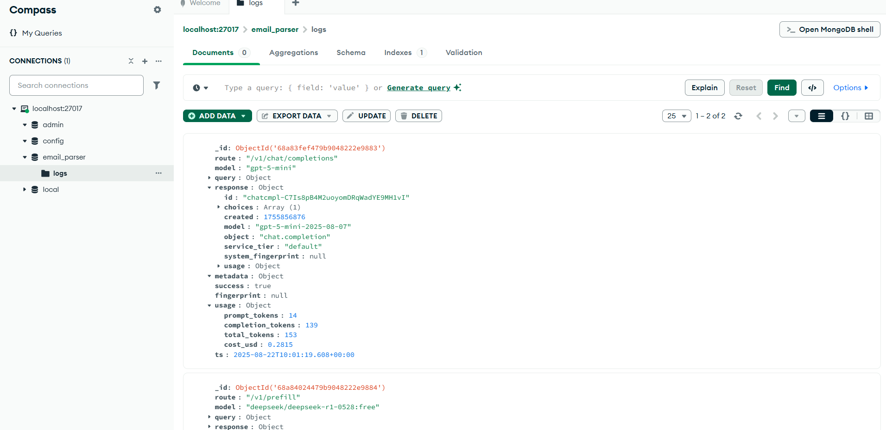
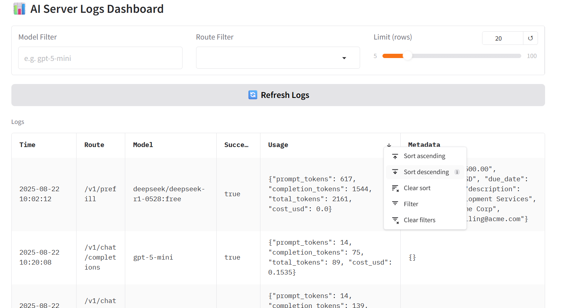

<div align="center">

# 📧 AI Email Server  
by **Omar Moured**

</div>

This project implements a simple AI server with two main features:
- **Chat Completions API** (OpenAI-compatible, proxying to OpenAI or OpenRouter models)  
- **Email Prefill Extraction** (extracts payment info from emails and logs results)  

Bonus features:
- **MongoDB logging** for all requests  
- **MD5 deduplication** to save costs - unique email processed only once
- **Token usage & cost tracking** to estimate the cost usage
- **Web Dashboard** (Gradio) to view logs interactively  

<div align="center">
  
  
</div>

---
 
### 📂 Project Structure
```bash
.
├── main.py                # FastAPI server (chat + prefill endpoints)
├── dashboard_gradio.py    # Gradio dashboard (log viewer)
├── public_test.py         # Test script for endpoints
├── requirements.txt       # Dependencies
└── README.md              # Documentation
```

---

### 🛠 Setup

The system was built with **Python 3.10**.

```bash
# 1. Create a new conda environment
conda create -n emailserver python=3.10 -y

# 2. Activate the environment
conda activate emailserver

# 3. Install dependencies
pip install -r requirements.txt
```

---

### 🔑 Environment Variables
You’ll need to set up your API keys and db URL.

```bash
$env:OPENAI_API_KEY="your_openai_key_here"
$env:OPENROUTER_API_KEY="your_openrouter_key_here"
$env:MONGO_URL="mongodb://localhost:27017"
```

---

### 🚀 Running the Servers

```bash
# server backend
uvicorn main:app --host 127.0.0.1 --port 8090 --reload
# Dashboard
python dashboard_gradio.py
```

---

### ✅ Running Tests

provided a simple test script public_test.py to verify endpoints.
```bash
python public_test.py
```

Expected output: 
```css
✓ Chat completions: Hi!
✓ Prefill: {"success":true,"message":"data extracted and written"}
Row 1: {...}
All tests passed!
```

---

### 📬 Contact
For any questions, feedback, or collaboration:
- **Email:** moured.omar@gmail.com 
- **LinkedIn:** [https://www.linkedin.com/in/omar-moured/](https://www.linkedin.com/in/omar-moured/) 